# Distributed-KV-Cache-Storage-System  
## How to start  
### vLLM Serving with bench
#### installation (refer to [vLLM installation](https://docs.vllm.ai/en/latest/getting_started/installation/gpu.html))
install uv
```C
pip3 install uv
uv venv --python 3.12 --seed  
source .venv/bin/activate  
```
install vllm & vllm[bench]
```C
uv pip3 install vllm==0.9.2 --torch-backend=auto
uv pip3 install vllm[bench]
```
#### serve and run (more at [Benchmark Suites](https://docs.vllm.ai/en/latest/contributing/benchmarks.html))
get dataset (online_benchmark)
```C
wget https://huggingface.co/datasets/anon8231489123/ShareGPT_Vicuna_unfiltered/resolve/main/ShareGPT_V3_unfiltered_cleaned_split.json
```
start serving model
```C
vllm serve Qwen/Qwen2.5-1.5B-Instruct
```
run benchmark
```C
vllm bench serve \
  --backend vllm \
  --model Qwen/Qwen2.5-1.5B-Instruct \
  --dataset-name sharegpt \
  --dataset-path <your data path>/ShareGPT_V3_unfiltered_cleaned_split.json
```

  
offline benchmarks
```C
vllm bench throughput \
  --model Qwen/Qwen2.5-7B-Instruct-GPTQ-Int4 \
  --dataset-name sonnet \
  --dataset-path vllm/benchmarks/sonnet.txt
```

### Disaggregated Serving with Mooncake-transfer-engine  (refer to [vLLM V0 Disaggregated Serving Demo](https://kvcache-ai.github.io/Mooncake/getting_started/examples/vllm-integration/vllm-integration-v0.2.html))
#### installation
install uv
```C
pip3 install uv
uv venv --python 3.12 --seed  
source .venv/bin/activate  
```
install vllm
```C
uv pip3 install vllm==0.9.2 --torch-backend=auto
```
if there is an error like "ValueError: 'aimv2' is already used by a Transformers config, pick another name." 
```C
uv pip install "transformers<4.54.0"
```
install mooncake-transfer-engine
```C
uv pip3 install mooncake-transfer-engine
```
#### configuartion
using 2 machines for decode and prefill node. set metadata server on prefill machine.
prepare a same `mooncake.json` file for both prefill and decode node.
```C
{
  "prefill_url": "prefill_node_ip:3300",
  "decode_url": "decode_node_ip:3300",
  "metadata_server": "metadata_server_ip:etcd_port",
  "metadata_backend": "etcd",
  "protocol": "tcp",
  "device_name": ""
}
```
#### run serving
start etcd server (metadata server) for transfer engine. The metadata server must be accessible from all nodes in the cluster, so its listening IP should be set to `0.0.0.0`. It can run on any machine accessible to all Mooncake nodes - it doesn't need to be co-located with the Master service or storage nodes. 
```C
etcd --listen-client-urls http://0.0.0.0:etcd_port --advertise-client-urls http://metadata_server_ip:etcd_port
```
start the prefill node
```C
MOONCAKE_CONFIG_PATH=./mooncake.json \
VLLM_DISTRIBUTED_KV_ROLE=producer \
python3 -m vllm.entrypoints.openai.api_server \
--model Qwen/Qwen2.5-7B-Instruct-GPTQ-Int4 \
--port 8100 \
--max-model-len 10000 \
--gpu-memory-utilization 0.95
```
start the decode node
```C
MOONCAKE_CONFIG_PATH=./mooncake.json \
VLLM_DISTRIBUTED_KV_ROLE=consumer  \
python3 -m vllm.entrypoints.openai.api_server \
--model Qwen/Qwen2.5-7B-Instruct-GPTQ-Int4 \
--port 8200 \
--max-model-len 10000 \
--gpu-memory-utilization 0.95
```
start the proxy server
`python3 proxy_server.py`
the `proxy_server.py` is
```C
import os

import aiohttp
from quart import Quart, make_response, request

AIOHTTP_TIMEOUT = aiohttp.ClientTimeout(total=6 * 60 * 60)

app = Quart(__name__)


async def forward_request(url, data):
    async with aiohttp.ClientSession(timeout=AIOHTTP_TIMEOUT) as session:
        headers = {
            "Authorization": f"Bearer {os.environ.get('OPENAI_API_KEY')}"
        }
        async with session.post(url=url, json=data,
                                headers=headers) as response:
            if response.status == 200:
                if True:
                    async for chunk_bytes in response.content.iter_chunked(
                            1024):
                        yield chunk_bytes
                else:
                    content = await response.read()
                    yield content


@app.route('/v1/completions', methods=['POST'])
async def handle_request():
    try:
        original_request_data = await request.get_json()

        prefill_request = original_request_data.copy()
        # change max_tokens = 1 to let it only do prefill
        prefill_request['max_tokens'] = 1

        # finish prefill
        async for _ in forward_request('http://localhost:8100/v1/completions',
                                       prefill_request):
            continue

        # return decode
        generator = forward_request('http://decode_node_ip:8200/v1/completions', # Be sure to change the IP address for your machine
                                    original_request_data)
        response = await make_response(generator)
        response.timeout = None

        return response

    except Exception as e:
        import sys
        import traceback
        exc_info = sys.exc_info()
        print("Error occurred in disagg prefill proxy server")
        print(e)
        print("".join(traceback.format_exception(*exc_info)))


if __name__ == '__main__':
    app.run(host="0.0.0.0",port=8000)
```
#### test with request
```C
curl -s http://localhost:8000/v1/completions -H "Content-Type: application/json" -d '{
  "model": "Qwen/Qwen2.5-7B-Instruct-GPTQ-Int4",
  "prompt": "San Francisco is a",
  "max_tokens": 1000
}'
```

### Disaggregated Serving with Mooncake-store (refer to [vLLM V0 Disaggregated Serving with MooncakeStore](https://kvcache-ai.github.io/Mooncake/getting_started/examples/vllm-integration/vllm-integration-v1.html#vllm-v0-disaggregated-serving-with-mooncakestore))
#### installation
install uv
```C
pip3 install uv
uv venv --python 3.12 --seed  
source .venv/bin/activate  
```
install vllm
```C
uv pip3 install vllm==0.9.2 --torch-backend=auto
```
if there is an error like "ValueError: 'aimv2' is already used by a Transformers config, pick another name." 
```C
uv pip install "transformers<4.54.0"
```
install mooncake-transfer-engine
```C
uv pip3 install mooncake-transfer-engine
```
#### configuartion
using 2 machines for decode and prefill node seperately. set metadata server on prefill machine. set master server on prefill machine.  
prepare a `mooncake.json` file for prefill node. (tcp)
```C
{
    "local_hostname": "prefill_node_ip",
    "metadata_server": "etcd://metadata_server_ip:etcd_port",
    "protocol": "tcp",
    "device_name": "",
    "master_server_address": "master_server_ip:50001"
}
```
`mooncake.json` file for prefill node. (rdma)
```C
{
    "local_hostname": "prefill_node_ip(rdma)",
    "metadata_server": "etcd://metadata_server_ip(rdma):etcd_port",
    "protocol": "rdma",
    "device_name": "erdma_0",
    "master_server_address": "master_server_ip(rdma):50001"
}
```
prepare a `mooncake.json` file for decode node. (tcp)
```C
{
    "local_hostname": "decode_node_ip",
    "metadata_server": "etcd://metadata_server_ip:etcd_port",
    "protocol": "tcp",
    "device_name": "",
    "master_server_address": "master_server_ip:50001"
}
```
`mooncake.json` file for decode node. (rdma)
```C
{
    "local_hostname":"decode_node_ip(rdma)",
    "metadata_server": "etcd://metadata_server_ip(rdma):etcd_port",
    "protocol": "rdma",
    "device_name": "erdma_0",
    "master_server_address": "master_server_ip(rdma):50001"
}
```
#### start serving
start etcd server (metadata server) for transfer engine. The metadata server must be accessible from all nodes in the cluster, so its listening IP should be set to `0.0.0.0`. It can run on any machine accessible to all Mooncake nodes - it doesn't need to be co-located with the Master service or storage nodes. 
```C
etcd --listen-client-urls http://0.0.0.0:etcd_port --advertise-client-urls http://metadata_server_ip:etcd_port
```
Start the mooncake_master server, default is 50051
```C
mooncake_master --port 50001
```
start the prefill node, the port here is used as the vLLM OpenAI API server ports for prefill nodes.
```C
MOONCAKE_CONFIG_PATH=./mooncake.json \
VLLM_USE_V1=0 \
python3 -m vllm.entrypoints.openai.api_server \
--model Qwen/Qwen2.5-7B-Instruct-GPTQ-Int4 \
--port 8100 \
--max-model-len 10000 \
--gpu-memory-utilization 0.8 \
--kv-transfer-config '{"kv_connector":"MooncakeStoreConnector","kv_role":"kv_producer"}'
```
start the decode node, the port here is used as the vLLM OpenAI API server ports for decode nodes.
```C
MOONCAKE_CONFIG_PATH=./mooncake.json \
VLLM_USE_V1=0 \
python3 -m vllm.entrypoints.openai.api_server \
--model Qwen/Qwen2.5-7B-Instruct-GPTQ-Int4 \
--port 8200 \
--max-model-len 10000 \
--gpu-memory-utilization 0.8 \
--kv-transfer-config '{"kv_connector":"MooncakeStoreConnector","kv_role":"kv_consumer"}'
```
start the proxy server. The proxy server communicates with prefill node and decode node to forward requests. The port here should be in line with the port set above.
```C
python3 vllm/examples/online_serving/disagg_examples/disagg_proxy_demo.py --model Qwen/Qwen2.5-7B-Instruct-GPTQ-Int4 --prefill prefill_node_ip:8100 --decode decode_node_ip:8200 --port 8000
```
the architecture is like this:

#### test with request
the port here should be in line with the port set above.
```C
curl -s http://localhost:8000/v1/completions -H "Content-Type: application/json" -d '{
  "model": "Qwen/Qwen2.5-7B-Instruct-GPTQ-Int4",
  "prompt": "San Francisco is a",
  "max_tokens": 1000
}'
```

### Disaggregated Serving with Mooncake-store and Multiple vllm instances (refer to [vLLM V0 Disaggregated Serving with MooncakeStore](https://kvcache-ai.github.io/Mooncake/getting_started/examples/vllm-integration/vllm-integration-v1.html#vllm-v0-disaggregated-serving-with-mooncakestore))
#### installation (same as before)
install uv
```C
pip3 install uv
uv venv --python 3.12 --seed  
source .venv/bin/activate  
```
install vllm
```C
uv pip3 install vllm==0.9.2 --torch-backend=auto
```
if there is an error like "ValueError: 'aimv2' is already used by a Transformers config, pick another name." 
```C
uv pip install "transformers<4.54.0"
```
install mooncake-transfer-engine
```C
uv pip3 install mooncake-transfer-engine
```
#### configuration
using 2 machines for prefill node and decode node seperately. using 4 GPUs (instances) on each machine. set metadata server, master server and proxy server on prefill machine. using rdma protocol. using one NIC device. The `mooncake.json` files are the same as before.
`mooncake.json` file for prefill nodes.  
```C
{
    "local_hostname": "prefill_machine_ip(rdma)",
    "metadata_server": "etcd://metadata_server_ip(rdma):etcd_port",
    "protocol": "rdma",
    "device_name": "erdma_0",
    "master_server_address": "master_server_ip(rdma):50001"
}
```
`mooncake.json` file for decode nodes. (rdma)
```C
{
    "local_hostname":"decode_machine_ip(rdma)",
    "metadata_server": "etcd://metadata_server_ip(rdma):etcd_port",
    "protocol": "rdma",
    "device_name": "erdma_0",
    "master_server_address": "master_server_ip(rdma):50001"
}
```
#### start serving
start etcd server (metadata server) for transfer engine. The metadata server must be accessible from all nodes in the cluster, so its listening IP should be set to `0.0.0.0`. It can run on any machine accessible to all Mooncake nodes - it doesn't need to be co-located with the Master service or storage nodes. 
```C
etcd --listen-client-urls http://0.0.0.0:etcd_port --advertise-client-urls http://metadata_server_ip:etcd_port
```
Start the mooncake_master server, default is 50051
```C
mooncake_master --port 50001
```
start the prefill node, the port here is used as the vLLM OpenAI API server ports for prefill nodes.
```C
CUDA_VISIBLE_DEVICES=0 MOONCAKE_CONFIG_PATH=./mooncake.json VLLM_USE_V1=0 python3 -m vllm.entrypoints.openai.api_server --model Qwen/Qwen2.5-7B-Instruct-GPTQ-Int4 --port 8100 --max-model-len 10000 --gpu-memory-utilization 0.8 --kv-transfer-config '{"kv_connector":"MooncakeStoreConnector","kv_role":"kv_producer"}'

CUDA_VISIBLE_DEVICES=1 MOONCAKE_CONFIG_PATH=./mooncake.json VLLM_USE_V1=0 python3 -m vllm.entrypoints.openai.api_server --model Qwen/Qwen2.5-7B-Instruct-GPTQ-Int4 --port 8101 --max-model-len 10000 --gpu-memory-utilization 0.8 --kv-transfer-config '{"kv_connector":"MooncakeStoreConnector","kv_role":"kv_producer"}'

CUDA_VISIBLE_DEVICES=2 MOONCAKE_CONFIG_PATH=./mooncake.json VLLM_USE_V1=0 python3 -m vllm.entrypoints.openai.api_server --model Qwen/Qwen2.5-7B-Instruct-GPTQ-Int4 --port 8102 --max-model-len 10000 --gpu-memory-utilization 0.8 --kv-transfer-config '{"kv_connector":"MooncakeStoreConnector","kv_role":"kv_producer"}'

CUDA_VISIBLE_DEVICES=3 MOONCAKE_CONFIG_PATH=./mooncake.json VLLM_USE_V1=0 python3 -m vllm.entrypoints.openai.api_server --model Qwen/Qwen2.5-7B-Instruct-GPTQ-Int4 --port 8103 --max-model-len 10000 --gpu-memory-utilization 0.8 --kv-transfer-config '{"kv_connector":"MooncakeStoreConnector","kv_role":"kv_producer"}'
```
start the decode node, the port here is used as the vLLM OpenAI API server ports for decode nodes.
```C
CUDA_VISIBLE_DEVICES=0 MOONCAKE_CONFIG_PATH=./mooncake.json VLLM_USE_V1=0 python3 -m vllm.entrypoints.openai.api_server --model Qwen/Qwen2.5-7B-Instruct-GPTQ-Int4 --port 8200 --max-model-len 10000 --gpu-memory-utilization 0.8 --kv-transfer-config '{"kv_connector":"MooncakeStoreConnector","kv_role":"kv_consumer"}'

CUDA_VISIBLE_DEVICES=1 MOONCAKE_CONFIG_PATH=./mooncake.json VLLM_USE_V1=0 python3 -m vllm.entrypoints.openai.api_server --model Qwen/Qwen2.5-7B-Instruct-GPTQ-Int4 --port 8201 --max-model-len 10000 --gpu-memory-utilization 0.8 --kv-transfer-config '{"kv_connector":"MooncakeStoreConnector","kv_role":"kv_consumer"}'

CUDA_VISIBLE_DEVICES=2 MOONCAKE_CONFIG_PATH=./mooncake.json VLLM_USE_V1=0 python3 -m vllm.entrypoints.openai.api_server --model Qwen/Qwen2.5-7B-Instruct-GPTQ-Int4 --port 8202 --max-model-len 10000 --gpu-memory-utilization 0.8 --kv-transfer-config '{"kv_connector":"MooncakeStoreConnector","kv_role":"kv_consumer"}'

CUDA_VISIBLE_DEVICES=3 MOONCAKE_CONFIG_PATH=./mooncake.json VLLM_USE_V1=0 python3 -m vllm.entrypoints.openai.api_server --model Qwen/Qwen2.5-7B-Instruct-GPTQ-Int4 --port 8203 --max-model-len 10000 --gpu-memory-utilization 0.8 --kv-transfer-config '{"kv_connector":"MooncakeStoreConnector","kv_role":"kv_consumer"}'
```
start the proxy server. The proxy server communicates with prefill node and decode node to forward requests. The port here should be in line with the port set above. The proxy server is set on the prefill machine and the server port is 8000.
```C
python3 vllm/examples/online_serving/disagg_examples/disagg_proxy_demo.py --model Qwen/Qwen2.5-7B-Instruct-GPTQ-Int4 --prefill prefill_machine_ip:8100 prefill_machine_ip:8101 prefill_machine_ip:8102 prefill_machine_ip:8103 --decode decode_machine_ip:8200 decode_machine_ip:8201  decode_machine_ip:8202  decode_machine_ip:8203 --port 8000
```
the architecture is like this:
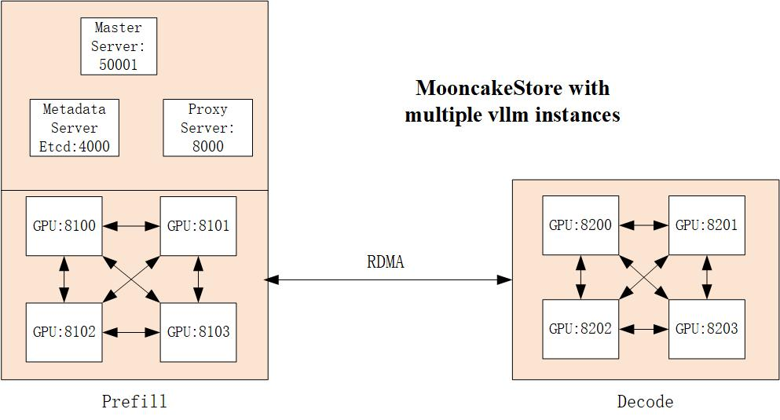
#### test with request
the port here should be in line with the port set above. `localhost` should be replaced with proxy server ip.
```C
curl -s http://localhost:8000/v1/completions -H "Content-Type: application/json" -d '{
  "model": "Qwen/Qwen2.5-7B-Instruct-GPTQ-Int4",
  "prompt": "San Francisco is a",
  "max_tokens": 1000
}'
```
#### screenshot
<table>
    <tr>
        <td ><center>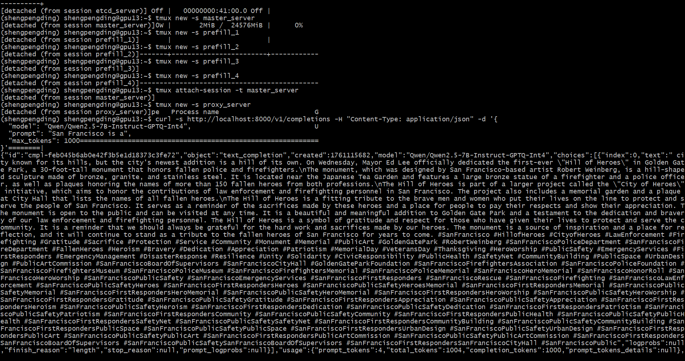 curl test result </center></td>
        <td ><center>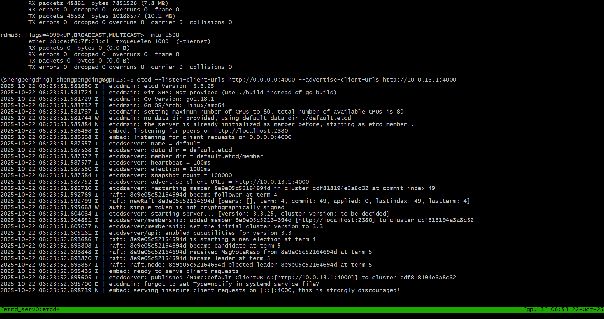 etcd server </center></td>
    </tr>
    <tr>
        <td ><center>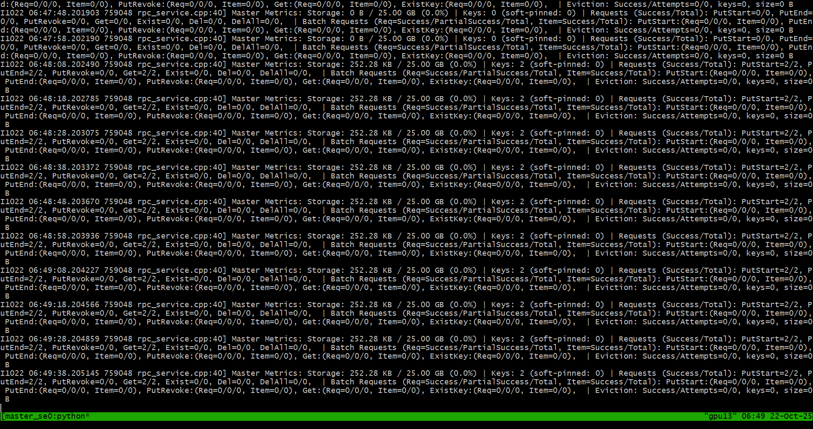 master server </center></td>
        <td ><center>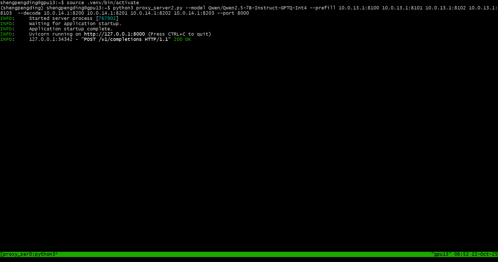 proxy server </center> </td>
    </tr>
    <tr>
        <td ><center>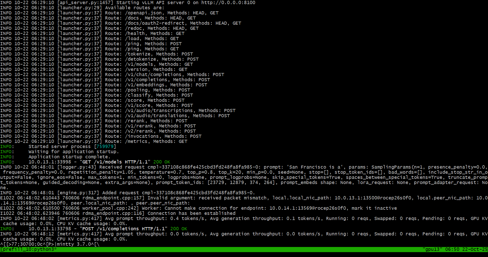 prefill instance1 </center></td>
        <td ><center>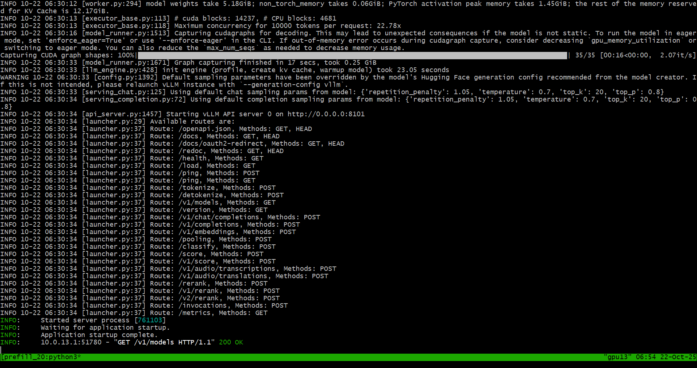 prefill instance2 </center> </td>
    </tr>
    <tr>
        <td ><center> prefill instance3 </center></td>
        <td ><center>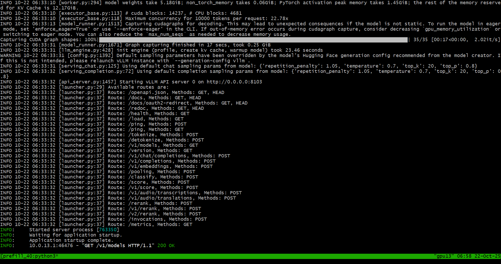 prefill instance4 </center> </td>
    </tr>
    <tr>
        <td ><center>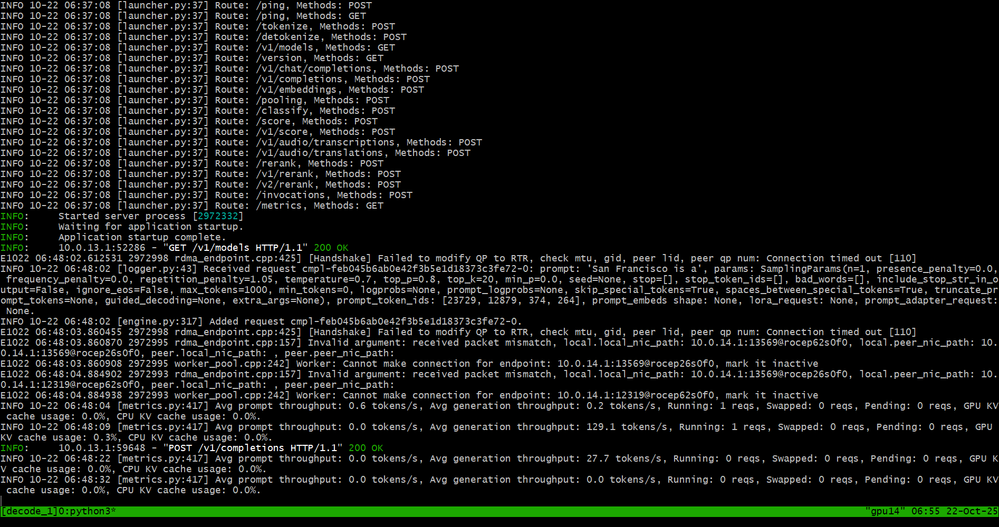 decode instance1 </center></td>
        <td ><center>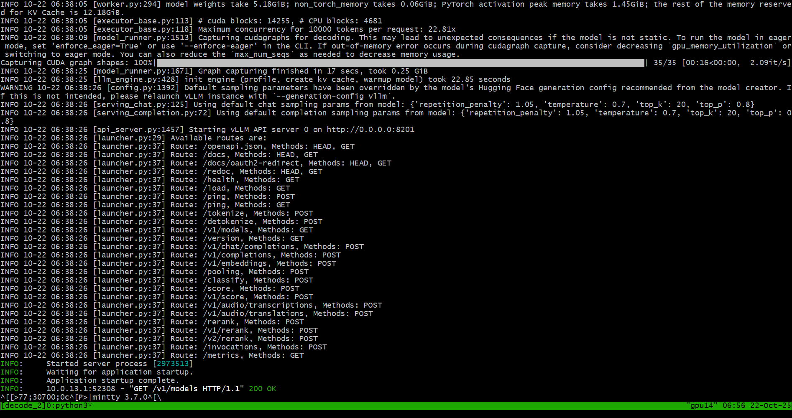 decode instance2 </center> </td>
    </tr>
    <tr>
        <td ><center> decode instance3 </center></td>
        <td ><center> decode instance4 </center> </td>
    </tr>
</table>

## Test prefix caching
using openai API 'user' field to pass arguments, designate specific prefill or decode nodes to handle request.
### preparation -- Designate prefill and decode node for requests
using 2 prefill node and 2 decode node. settings are the same as before. edit `proxy_server.py` in Disaggregated Serving with Mooncake-store and the modified file can be seen in this repository as `proxy_server.py`.  

### start serving and test designation
using 2 prefill nodes and 2 decode nodes. procedure of starting serving is the same as before.  
```C
curl -s http://localhost:8000/v1/completions -H "Content-Type: application/json" -d '{
  "model": "Qwen/Qwen2.5-7B-Instruct-GPTQ-Int4",
  "prompt": "San Francisco is a",
  "max_tokens": 1000,
  "user":"prefill=prefill_node_ip:port;decode=decode_node_ip:port"
}'
```
from picture below, only the designated nodes received the request and start working.
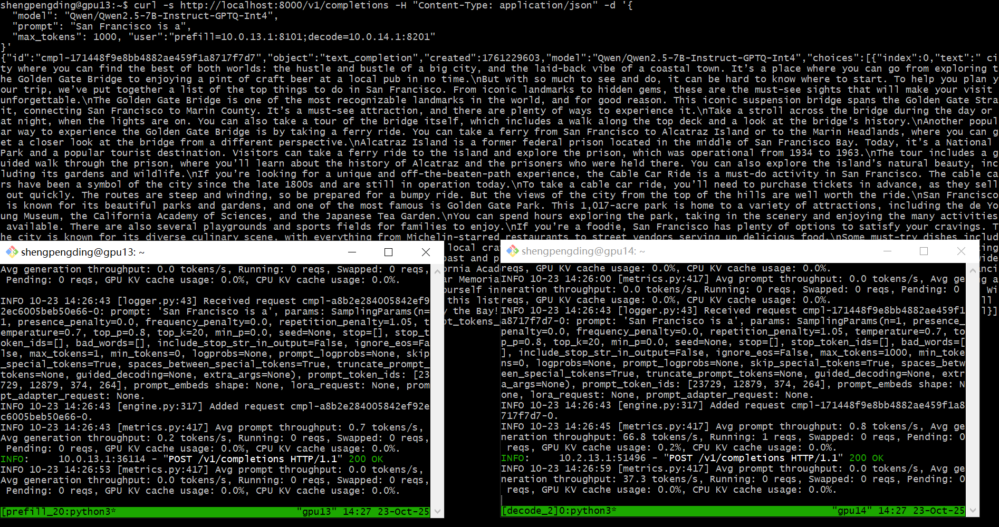
### test prefix caching -- start serving
using 4 prefill nodes and 4 decode nodes. the settings are the same as before. the procedure to start serving is the same as before. Exept for the `--enable-prefix-caching` when to start vllm instances.  
```C
CUDA_VISIBLE_DEVICES=0 MOONCAKE_CONFIG_PATH=./mooncake.json VLLM_USE_V1=0 python3 -m vllm.entrypoints.openai.api_server --model Qwen/Qwen2.5-7B-Instruct-GPTQ-Int4 --port 8100 --max-model-len 10000 --gpu-memory-utilization 0.8 --kv-transfer-config '{"kv_connector":"MooncakeStoreConnector","kv_role":"kv_producer"}' --enable-prefix-caching

CUDA_VISIBLE_DEVICES=1 MOONCAKE_CONFIG_PATH=./mooncake.json VLLM_USE_V1=0 python3 -m vllm.entrypoints.openai.api_server --model Qwen/Qwen2.5-7B-Instruct-GPTQ-Int4 --port 8101 --max-model-len 10000 --gpu-memory-utilization 0.8 --kv-transfer-config '{"kv_connector":"MooncakeStoreConnector","kv_role":"kv_producer"}' --enable-prefix-caching

CUDA_VISIBLE_DEVICES=2 MOONCAKE_CONFIG_PATH=./mooncake.json VLLM_USE_V1=0 python3 -m vllm.entrypoints.openai.api_server --model Qwen/Qwen2.5-7B-Instruct-GPTQ-Int4 --port 8102 --max-model-len 10000 --gpu-memory-utilization 0.8 --kv-transfer-config '{"kv_connector":"MooncakeStoreConnector","kv_role":"kv_producer"}' --enable-prefix-caching

CUDA_VISIBLE_DEVICES=3 MOONCAKE_CONFIG_PATH=./mooncake.json VLLM_USE_V1=0 python3 -m vllm.entrypoints.openai.api_server --model Qwen/Qwen2.5-7B-Instruct-GPTQ-Int4 --port 8103 --max-model-len 10000 --gpu-memory-utilization 0.8 --kv-transfer-config '{"kv_connector":"MooncakeStoreConnector","kv_role":"kv_producer"}' --enable-prefix-caching
```
the decode nodes also
```C
CUDA_VISIBLE_DEVICES=0 MOONCAKE_CONFIG_PATH=./mooncake.json VLLM_USE_V1=0 python3 -m vllm.entrypoints.openai.api_server --model Qwen/Qwen2.5-7B-Instruct-GPTQ-Int4 --port 8200 --max-model-len 10000 --gpu-memory-utilization 0.8 --kv-transfer-config '{"kv_connector":"MooncakeStoreConnector","kv_role":"kv_consumer"}' --enable-prefix-caching

CUDA_VISIBLE_DEVICES=1 MOONCAKE_CONFIG_PATH=./mooncake.json VLLM_USE_V1=0 python3 -m vllm.entrypoints.openai.api_server --model Qwen/Qwen2.5-7B-Instruct-GPTQ-Int4 --port 8201 --max-model-len 10000 --gpu-memory-utilization 0.8 --kv-transfer-config '{"kv_connector":"MooncakeStoreConnector","kv_role":"kv_consumer"}' --enable-prefix-caching

CUDA_VISIBLE_DEVICES=2 MOONCAKE_CONFIG_PATH=./mooncake.json VLLM_USE_V1=0 python3 -m vllm.entrypoints.openai.api_server --model Qwen/Qwen2.5-7B-Instruct-GPTQ-Int4 --port 8202 --max-model-len 10000 --gpu-memory-utilization 0.8 --kv-transfer-config '{"kv_connector":"MooncakeStoreConnector","kv_role":"kv_consumer"}' --enable-prefix-caching

CUDA_VISIBLE_DEVICES=3 MOONCAKE_CONFIG_PATH=./mooncake.json VLLM_USE_V1=0 python3 -m vllm.entrypoints.openai.api_server --model Qwen/Qwen2.5-7B-Instruct-GPTQ-Int4 --port 8203 --max-model-len 10000 --gpu-memory-utilization 0.8 --kv-transfer-config '{"kv_connector":"MooncakeStoreConnector","kv_role":"kv_consumer"}' --enable-prefix-caching
```
### dataset
the dataset used to test has the openai API format.
```C
{"model": model_name, "max_tokens": interger_number, "prompt": long prompt, "user": "prefill=prefill_node_ip:server_port;decode=decode_node_ip:server_port"}
```
one of the real generated request is like:
```C
{"model": "Qwen/Qwen2.5-7B-Instruct-GPTQ-Int4", "max_tokens": 100, "prompt": "Shared context #0: This is long context. This is long context. This is long context. This is long context. This is long context. This is long context. This is long context. This is long context. This is long context. This is long context. This is long context. This is long context. This is long context. This is long context. This is long context. This is long context. This is long context. This is long context. This is long context. This is long context. Question 0: Summarize the context.", "user": "prefill=10.0.13.1:8101;decode=10.0.14.1:8200"}
```
The prompt uses long prefix text to test prefix caching, followed by a question based on the test. using `user` field to designate prefill node and decode node and divert requests.  
The dataset is generated automatically by the python script according to 3 kinds of given testing strategies: `Random`, `Designate`, `RR`. `Random` strategy picks randomly among the nodes to form the request. 'Designate' uses the given node url to form the request. `RR` perfoms round robin to pick nodes to generate requests.  
### metrics (refer to [vLLM Metrics](https://docs.vllm.ai/en/stable/design/metrics.html#v0-metrics))
vllm exposes a set of metrics which can be accessed by post a request to the vllm server.
```C
curl http://server_ip:port/metrics
```
The gpu and cpu prefix cache hit rate can be seen after the request is handled in each instance.
### test prefix caching -- result
using a python script to generate dataset and post requests to the proxy server. the python file can be seen from this repository as `test_prefix_caching.py`.  
#### Designate strategy
first, using `Designate` strategy to generate 20 requests and designate only one prefill node.  the first time of the 20 request shows that the GPU prefix cache hit rate is 0 because each request is added a sequence number and it's different. The second time to run the script which would generate the same dataset including the sequence no. as the first batch, so the second batch shows the result.
```C
python3 test_prefix_caching.py \
--model Qwen/Qwen2.5-7B-Instruct-GPTQ-Int4 \
--use-requests \
--proxy http://127.0.0.1:8000 \
--request-num 20 \
--strategy Random \
--prefill 10.0.13.1:8100 \
--datapath prefix_cache_test.jsonl
```
the result shows that the designated prefill node has 50% GPU hit rate because they uses the same prefix as the first batch of 20 requests, while the others have 0. they even don't received requests (picture2.first)
<table>
    <tr>
        <td ><center>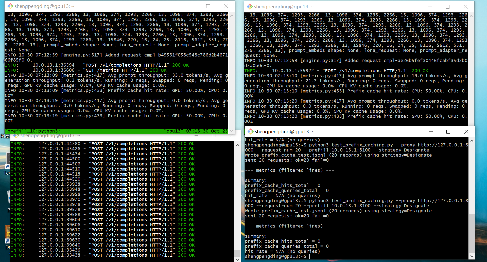 Designate prefill1 result </center></td>
        <td ><center>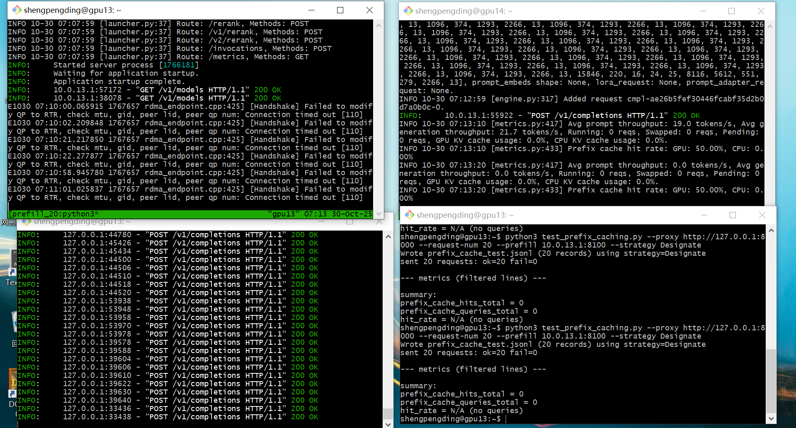 Designate_prefill2-4 result </center></td>
    </tr>
</table>  

#### RR strategy
using `RR` strategy to generate 20 requests and designate nodes suing Round Robin. the first time of the 20 request shows that the GPU prefix cache hit rate is 0. The second time to run the script shows the result.  
```C
python3 test_prefix_caching.py \
--model Qwen/Qwen2.5-7B-Instruct-GPTQ-Int4 \
--use-requests \
--proxy http://127.0.0.1:8000 \
--request-num 20 \
--strategy RR \
--datapath prefix_cache_test.jsonl
```
the result shows that the RR designated prefill node has 50% GPU hit rate while the others have 0. the decode node rate is different because when the prefill is using `RR`, the decode is using random
<table>
    <tr>
        <td ><center>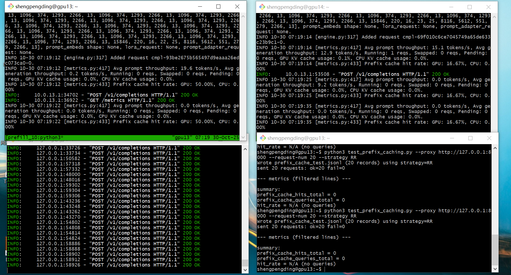 RR node1 result </center></td>
        <td ><center>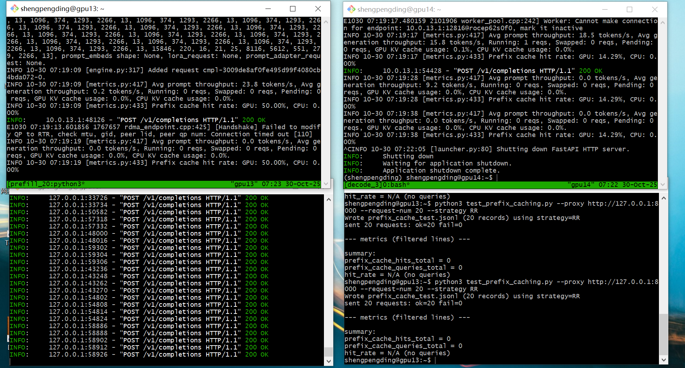 RR node2 result </center></td>
    </tr>
    <tr>
        <td ><center>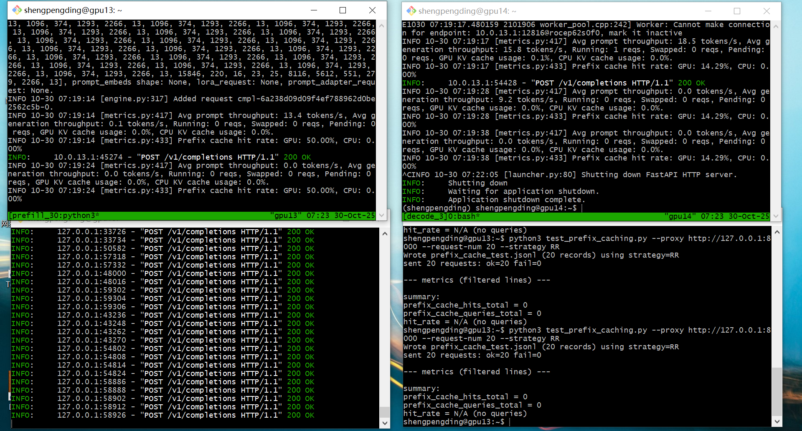 RR node1 result </center></td>
        <td ><center> RR node2 result </center></td>
    </tr>  
</table>  

#### Random strategy
using `Random` strategy to generate 20 requests and designate nodes suing Round Robin. the first time of the 20 request shows that the GPU prefix cache hit rate is 0. The second time to run the script shows the result.  
```C
python3 test_prefix_caching.py \
--model Qwen/Qwen2.5-7B-Instruct-GPTQ-Int4 \
--use-requests \
--proxy http://127.0.0.1:8000 \
--request-num 20 \
--strategy Random \
--datapath prefix_cache_test.jsonl
```
the result shows that no matter what kind of node using random strategy, the GPU prefix cache hit rate is far below the 50%, because the first set of 20 reqeust prefix cache is spread randomly, which leads to less prefix cache to use in the second round. let alone the second round still picks nodes randomly.
<table>
    <tr>
        <td ><center>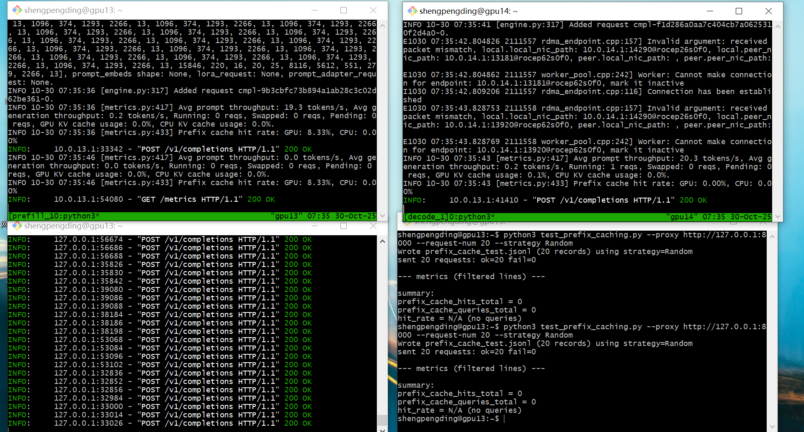 Random node1 result </center></td>
        <td ><center>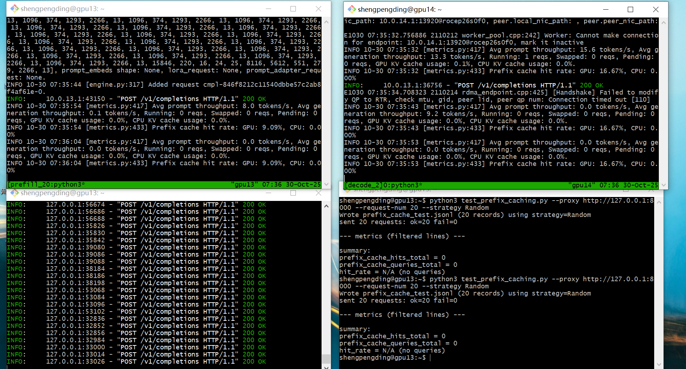 Random node2 result </center></td>
    </tr>
    <tr>
        <td ><center>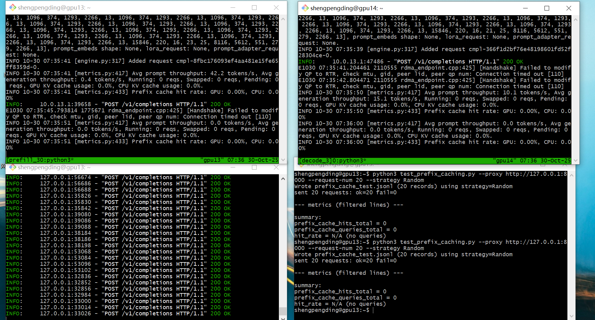 Random node1 result </center></td>
        <td ><center> Random node2 result </center></td>
    </tr>  
</table>  

#### test same prefix
the above stratety test uses requests with a sequence number which makes each different, so the result of first batch is always 0. here test if delete the difference made by this seq no., the change of GPU prefix cache hit rate.  using a simple script to request
```C
import json
import requests
with open("test.jsonl") as f:
    for line in f:
        payload = json.loads(line)
        response = requests.post("http://127.0.0.1:8000/v1/completions", json=payload)
        print(payload)
```
the `test.jsonl` contains request below 10 times. the seq no is the same.
```C
{"model": "Qwen/Qwen2.5-7B-Instruct-GPTQ-Int4", "max_tokens": 100, "prompt": "Shared context #0: This is long context. This is long context. This is long context. This is long context. This is long context. This is long context. This is long context. This is long context. This is long context. This is long context. This is long context. This is long context. This is long context. This is long context. This is long context. This is long context. This is long context. This is long context. This is long context. This is long context. Question 0: Summarize the context.", "user": "prefill=10.0.13.1:8103;decode=10.0.14.1:8203"}
```
the result is 90%
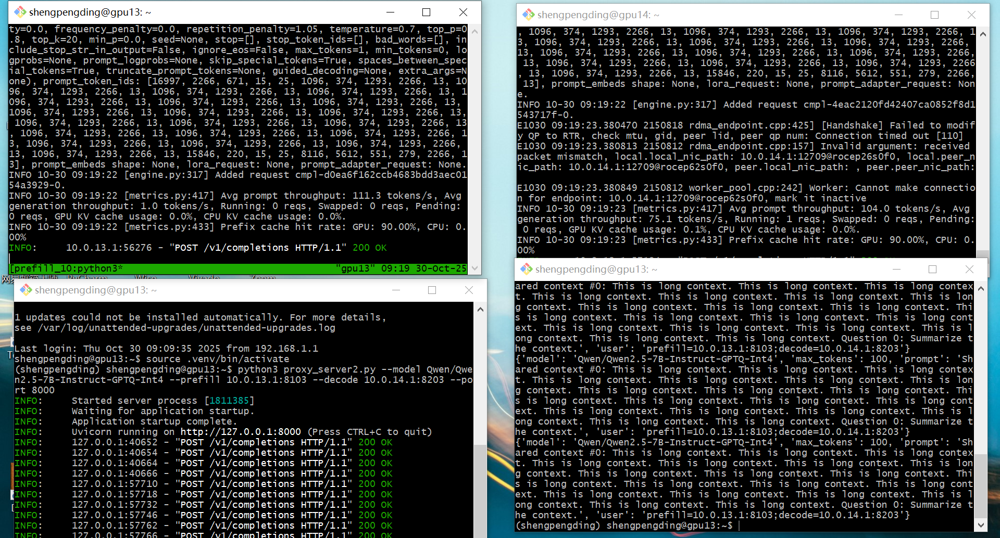
### test get() and put()
use 2 prefill nodes and 2 decode nodes and deploy prefill nodes on different machines. 
#### request data
the 2 requests below have designated prefill nodes on 2 different machines
```C
{"model": "Qwen/Qwen2.5-7B-Instruct-GPTQ-Int4", "max_tokens": 100, "prompt": "Shared context #0: This is long context. This is long context. This is long context. This is long context. This is long context. This is long context. This is long context. This is long context. This is long context. This is long context. This is long context. This is long context. This is long context. This is long context. This is long context. This is long context. This is long context. This is long context. This is long context. This is long context. Question 0: Summarize the context.", "user": "prefill=10.0.13.1:8103;decode=10.0.13.1:8102"}
{"model": "Qwen/Qwen2.5-7B-Instruct-GPTQ-Int4", "max_tokens": 100, "prompt": "Shared context #0: This is long context. This is long context. This is long context. This is long context. This is long context. This is long context. This is long context. This is long context. This is long context. This is long context. This is long context. This is long context. This is long context. This is long context. This is long context. This is long context. This is long context. This is long context. This is long context. This is long context. Question 0: Summarize the context.", "user": "prefill=10.0.14.1:8103;decode=10.0.14.1:8202"}
```
#### request script
use this simple script to send requests.
```C
import json
import requests
with open("test3.jsonl") as f:
    for line in f:
        payload = json.loads(line)
        response = requests.post("http://127.0.0.1:8000/v1/completions", json=payload)
        print(payload)
```
#### result
master_node has info: objects already exists.
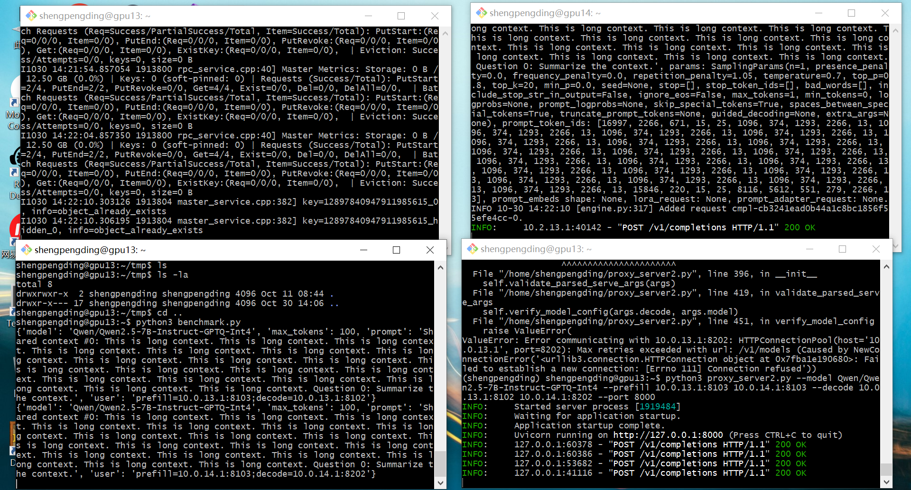
