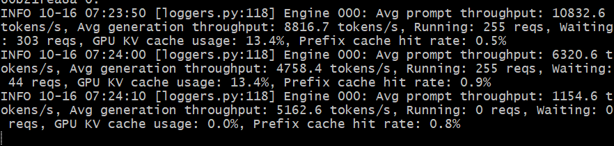
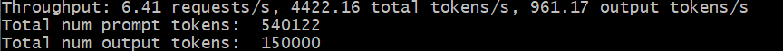
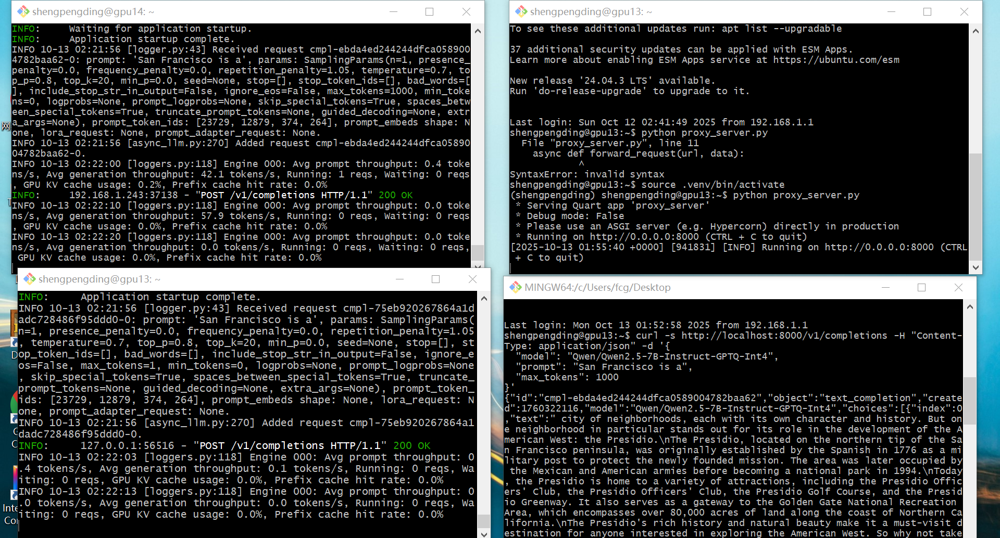
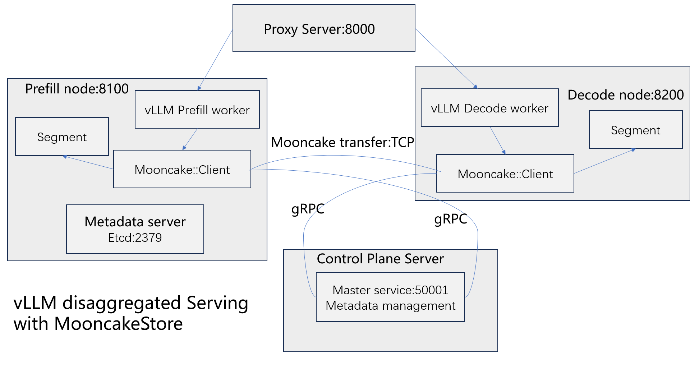
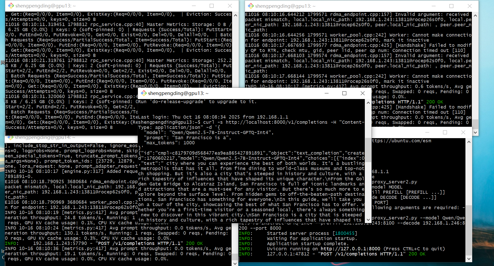

# Distributed-KV-Cache-Storage-System  
## How to start  
### vLLM Serving with bench
#### installation (refer to [vLLM installation](https://docs.vllm.ai/en/latest/getting_started/installation/gpu.html))
install uv
```C
pip3 install uv
uv venv --python 3.12 --seed  
source .venv/bin/activate  
```
install vllm & vllm[bench]
```C
uv pip3 install vllm==0.9.2 --torch-backend=auto
uv pip3 install vllm[bench]
```
#### serve and run (more at [Benchmark Suites](https://docs.vllm.ai/en/latest/contributing/benchmarks.html))
get dataset (online_benchmark)
```C
wget https://huggingface.co/datasets/anon8231489123/ShareGPT_Vicuna_unfiltered/resolve/main/ShareGPT_V3_unfiltered_cleaned_split.json
```
start serving model
```C
vllm serve Qwen/Qwen2.5-1.5B-Instruct
```
run benchmark
```C
vllm bench serve \
  --backend vllm \
  --model Qwen/Qwen2.5-1.5B-Instruct \
  --dataset-name sharegpt \
  --dataset-path <your data path>/ShareGPT_V3_unfiltered_cleaned_split.json
```

  
offline benchmarks
```C
vllm bench throughput \
  --model Qwen/Qwen2.5-7B-Instruct-GPTQ-Int4 \
  --dataset-name sonnet \
  --dataset-path vllm/benchmarks/sonnet.txt
```

### Disaggregated Serving with Mooncake-transfer-engine  (refer to [vLLM V0 Disaggregated Serving Demo](https://kvcache-ai.github.io/Mooncake/getting_started/examples/vllm-integration/vllm-integration-v0.2.html))
#### installation
install uv
```C
pip3 install uv
uv venv --python 3.12 --seed  
source .venv/bin/activate  
```
install vllm
```C
uv pip3 install vllm==0.9.2 --torch-backend=auto
```
if there is an error like "ValueError: 'aimv2' is already used by a Transformers config, pick another name." 
```C
uv pip install "transformers<4.54.0"
```
install mooncake-transfer-engine
```C
uv pip3 install mooncake-transfer-engine
```
#### configuartion
using 2 machines for decode and prefill node. set metadata server on prefill machine.
prepare a same `mooncake.json` file for both prefill and decode node.
```C
{
  "prefill_url": "prefill_node_ip:3300",
  "decode_url": "decode_node_ip:3300",
  "metadata_server": "metadata_server_ip:etcd_port",
  "metadata_backend": "etcd",
  "protocol": "tcp",
  "device_name": ""
}
```
#### run serving
start etcd server (metadata server) for transfer engine. The metadata server must be accessible from all nodes in the cluster, so its listening IP should be set to `0.0.0.0`. It can run on any machine accessible to all Mooncake nodes - it doesn't need to be co-located with the Master service or storage nodes. 
```C
etcd --listen-client-urls http://0.0.0.0:etcd_port --advertise-client-urls http://metadata_server_ip:etcd_port
```
start the prefill node
```C
MOONCAKE_CONFIG_PATH=./mooncake.json \
VLLM_DISTRIBUTED_KV_ROLE=producer \
python3 -m vllm.entrypoints.openai.api_server \
--model Qwen/Qwen2.5-7B-Instruct-GPTQ-Int4 \
--port 8100 \
--max-model-len 10000 \
--gpu-memory-utilization 0.95
```
start the decode node
```C
MOONCAKE_CONFIG_PATH=./mooncake.json \
VLLM_DISTRIBUTED_KV_ROLE=consumer  \
python3 -m vllm.entrypoints.openai.api_server \
--model Qwen/Qwen2.5-7B-Instruct-GPTQ-Int4 \
--port 8200 \
--max-model-len 10000 \
--gpu-memory-utilization 0.95
```
start the proxy server
`python3 proxy_server.py`
the `proxy_server.py` is
```C
import os

import aiohttp
from quart import Quart, make_response, request

AIOHTTP_TIMEOUT = aiohttp.ClientTimeout(total=6 * 60 * 60)

app = Quart(__name__)


async def forward_request(url, data):
    async with aiohttp.ClientSession(timeout=AIOHTTP_TIMEOUT) as session:
        headers = {
            "Authorization": f"Bearer {os.environ.get('OPENAI_API_KEY')}"
        }
        async with session.post(url=url, json=data,
                                headers=headers) as response:
            if response.status == 200:
                if True:
                    async for chunk_bytes in response.content.iter_chunked(
                            1024):
                        yield chunk_bytes
                else:
                    content = await response.read()
                    yield content


@app.route('/v1/completions', methods=['POST'])
async def handle_request():
    try:
        original_request_data = await request.get_json()

        prefill_request = original_request_data.copy()
        # change max_tokens = 1 to let it only do prefill
        prefill_request['max_tokens'] = 1

        # finish prefill
        async for _ in forward_request('http://localhost:8100/v1/completions',
                                       prefill_request):
            continue

        # return decode
        generator = forward_request('http://decode_node_ip:8200/v1/completions', # Be sure to change the IP address for your machine
                                    original_request_data)
        response = await make_response(generator)
        response.timeout = None

        return response

    except Exception as e:
        import sys
        import traceback
        exc_info = sys.exc_info()
        print("Error occurred in disagg prefill proxy server")
        print(e)
        print("".join(traceback.format_exception(*exc_info)))


if __name__ == '__main__':
    app.run(host="0.0.0.0",port=8000)
```
#### test with request
```C
curl -s http://localhost:8000/v1/completions -H "Content-Type: application/json" -d '{
  "model": "Qwen/Qwen2.5-7B-Instruct-GPTQ-Int4",
  "prompt": "San Francisco is a",
  "max_tokens": 1000
}'
```

### Disaggregated Serving with Mooncake-store (refer to [vLLM V0 Disaggregated Serving with MooncakeStore](https://kvcache-ai.github.io/Mooncake/getting_started/examples/vllm-integration/vllm-integration-v1.html#vllm-v0-disaggregated-serving-with-mooncakestore))
#### installation
install uv
```C
pip3 install uv
uv venv --python 3.12 --seed  
source .venv/bin/activate  
```
install vllm
```C
uv pip3 install vllm==0.9.2 --torch-backend=auto
```
if there is an error like "ValueError: 'aimv2' is already used by a Transformers config, pick another name." 
```C
uv pip install "transformers<4.54.0"
```
install mooncake-transfer-engine
```C
uv pip3 install mooncake-transfer-engine
```
#### configuartion
using 2 machines for decode and prefill node. set proxy metadata server on prefill machine. set master server on prefill machine.
prepare a `mooncake.json` file for prefill node.
```C
{
    "local_hostname": "prefill_node_ip",
    "metadata_server": "etcd://metadata_server_ip:etcd_port",
    "protocol": "tcp",
    "device_name": "",
    "master_server_address": "prefill_node_ip:50001"
}
```
prepare a `mooncake.json` file for decode node.
```C
{
    "local_hostname": "decode_node_ip",
    "metadata_server": "etcd://metadata_server_ip:etcd_port",
    "protocol": "tcp",
    "device_name": "",
    "master_server_address": "prefill_node_ip:50001"
}
```
#### start serving
start etcd server (metadata server) for transfer engine. The metadata server must be accessible from all nodes in the cluster, so its listening IP should be set to `0.0.0.0`. It can run on any machine accessible to all Mooncake nodes - it doesn't need to be co-located with the Master service or storage nodes. 
```C
etcd --listen-client-urls http://0.0.0.0:etcd_port --advertise-client-urls http://metadata_server_ip:etcd_port
```
Start the mooncake_master server, default is 50051
```C
mooncake_master --port 50001
```
start the prefill node, the port here is used as the vLLM OpenAI API server ports for prefill nodes.
```C
MOONCAKE_CONFIG_PATH=./mooncake.json \
VLLM_USE_V1=0 \
python3 -m vllm.entrypoints.openai.api_server \
--model Qwen/Qwen2.5-7B-Instruct-GPTQ-Int4 \
--port 8100 \
--max-model-len 10000 \
--gpu-memory-utilization 0.8 \
--kv-transfer-config '{"kv_connector":"MooncakeStoreConnector","kv_role":"kv_producer"}'
```
start the decode node, the port here is used as the vLLM OpenAI API server ports for decode nodes.
```C
MOONCAKE_CONFIG_PATH=./mooncake.json \
VLLM_USE_V1=0 \
python3 -m vllm.entrypoints.openai.api_server \
--model Qwen/Qwen2.5-7B-Instruct-GPTQ-Int4 \
--port 8200 \
--max-model-len 10000 \
--gpu-memory-utilization 0.8 \
--kv-transfer-config '{"kv_connector":"MooncakeStoreConnector","kv_role":"kv_consumer"}'
```
start the proxy server. The proxy server communicates with prefill node and decode node to forward requests. The port here should be in line with the port set above.
```C
python3 vllm/examples/online_serving/disagg_examples/disagg_proxy_demo.py --model Qwen/Qwen2.5-7B-Instruct-GPTQ-Int4 --prefill prefill_node_ip:8100 --decode decode_node_ip:8200 --port 8000
```
the architecture is like this:

#### test with request
the port here should be in line with the port set above.
```C
curl -s http://localhost:8000/v1/completions -H "Content-Type: application/json" -d '{
  "model": "Qwen/Qwen2.5-7B-Instruct-GPTQ-Int4",
  "prompt": "San Francisco is a",
  "max_tokens": 1000
}'
```

